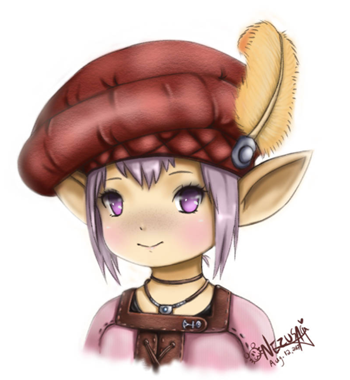
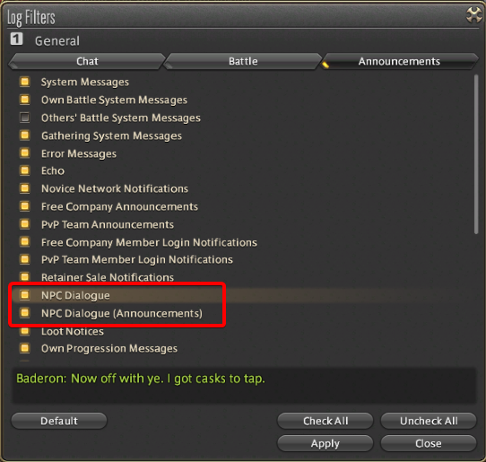
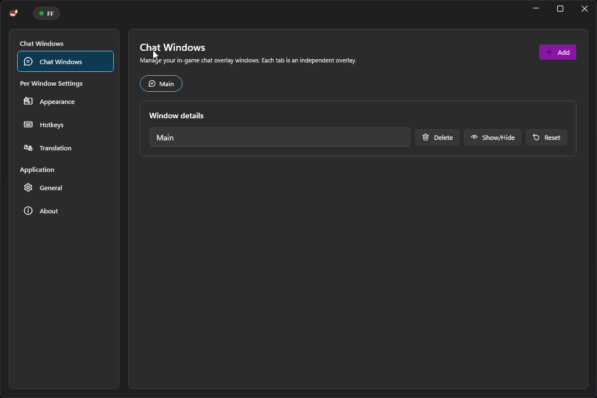

  

<h1 align="center">Tataru Helper</h1>

Real-time translation overlay for Final Fantasy XIV in-game text.

Maintained by <a href="https://github.com/xDarkOne">xDarkOne</a>. A fork of the original project by <a href="https://github.com/NightlyRevenger/TataruHelper">NightlyRevenger</a>.

  
  
  
  
  
  

<strong>Download Stats</strong>

  

<strong><a href="https://github.com/xDarkOne/TataruHelper/releases/latest/download/Setup.exe">Download Setup.exe</a></strong> · <a href="Documents/Guide.MD">Guide</a> · <a href="https://discord.gg/bSrpbd9">Discord</a>

<strong>Languages:</strong> <a href="README.md">EN</a> | <a href="Documents/README_ru_RU.md">RU</a> | <a href="Documents/README_ko_KR.md">KO</a> | <a href="Documents/README_es_ES.md">ES</a> | <a href="Documents/README_ca_ES.md">CA</a> | <a href="Documents/README_pl_PL.md">PL</a> | <a href="Documents/README_pt_BR.md">PT-BR</a> | <a href="Documents/README_uk_UA.md">UK</a> | <a href="Documents/README_zh_ZH.md">ZH</a> | <a href="Documents/README_ja_JP.md">JA</a>

## Features

- Translates in-game Japanese text (MSQ, cutscenes, quests, NPC lines, and chat).
- Supports selectable source and destination languages.
- Lets you switch translation engines and methods.
- Can target specific chat channels for translation.
- Includes automatic updates.

## Requirements

- Windows 10 x64 or newer.
- Final Fantasy XIV running with DirectX 11 (x64 client).
- Administrator rights, which the application asks for on start: it reads the
  game's text out of the game's own memory.

No .NET runtime to install — the release carries its own.

## Quick Install

1. Download the latest installer from [Releases](https://github.com/xDarkOne/TataruHelper/releases/latest).
2. Run `Setup.exe`. If SmartScreen appears, select **More info** and then **Run anyway**.
3. Let Tataru Helper launch and complete the initial language/setup flow.
4. Close settings and place the floating overlay where you want it.
5. In FFXIV chat settings, enable the required message types shown below.

## Usage

- Full usage walkthrough: [Guide](Documents/Guide.MD).
- After install, launch from the desktop/start-menu shortcut (not from `Setup.exe` again).

## Demo

- Video demo: [YouTube demonstration](https://youtu.be/7HiQXzmkQuw)
- Live preview gifs:

## Contributing / Translation

- Code contributions are welcome via pull requests.
- Help translate the app on [Crowdin](https://crowdin.com/project/tataru-helper).

## Credits

Thanks to all contributors and the projects that helped make Tataru Helper possible:

- [TataruHelper by NightlyRevenger](https://github.com/NightlyRevenger/TataruHelper) — the original, which this is a fork of
- [TataruHelper by progneo](https://github.com/progneo/TataruHelper) — the fork this one carries on from
- [Sharlayan](https://github.com/FFXIVAPP/sharlayan) — reads the game's text out of its memory
- [XIV Rus Translation](https://github.com/xivrus/xiv_ru_weblate) — the hand-made Russian translation this shows instead of a machine's
- [WPF Toolkit](https://github.com/xceedsoftware/wpftoolkit)
- [NHotKey.Wpf](https://github.com/thomaslevesque/NHotkey)
- [NotifyIcon WPF](https://bitbucket.org/hardcodet/notifyicon-wpf/)
- [Velopack](https://github.com/velopack/velopack) — the installer and updater
- [Tataru Art by Nezusagi](https://www.deviantart.com/nezusagi)

### Doing the same thing another way

If you play with [Dalamud](https://github.com/goatcorp/Dalamud), it is worth knowing about
[Echoglossian](https://github.com/lokinmodar/Echoglossian) — a plugin that translates dialogue
inside the game rather than in an overlay beside it.

## Contacts

- Original community Discord: [discord.gg/bSrpbd9](https://discord.gg/bSrpbd9)

## License

[MIT](LICENSE)
